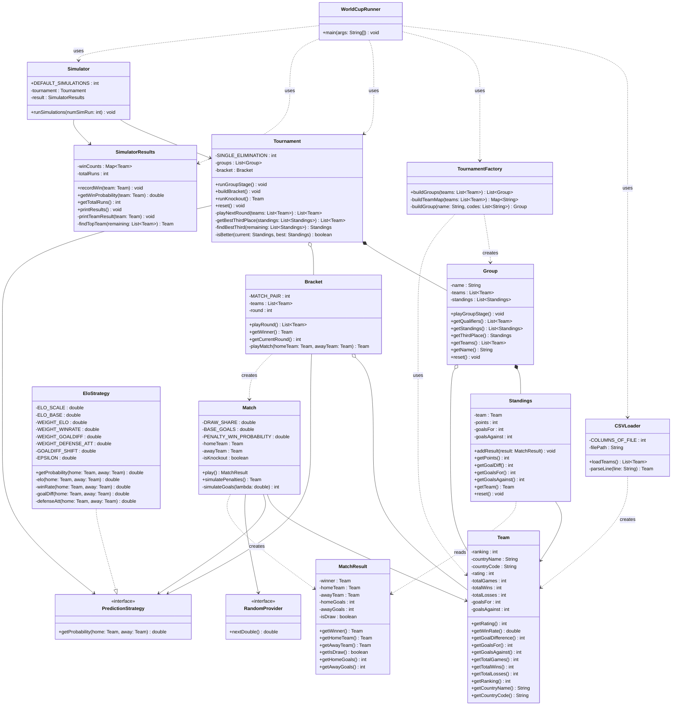

# 2026 World Cup Simulator

A simulator that scrapes historical ELO rating data for all 48 qualified nations and predicts the winner of the 2026 FIFA World Cup.

## How It Works

The data pipeline fetches live data from [eloratings.net](https://eloratings.net) and filters it down to only the 48 qualified teams, producing a CSV with the following stats per team:

| Column | Description |
|---|---|
| `Ranking` | Current world ranking |
| `CountryNames` | Full country name |
| `Country` | Country code |
| `Rating` | ELO rating |
| `TotalGames` | Total games played |
| `TotalWins` | Total wins |
| `TotalLosses` | Total losses |
| `GoalsScored` | Total goals scored |
| `GoalsConceded` | Total goals conceded |

## Architecture



## Project Structure

```
├── WorldCupData.py         # Main script — scrapes and outputs CSV
├── DataColumns.py          # Column index config for the TSV source
├── ListOfQualifiedTeams.py # List of all 48 qualified teams
└── QualifiedWorldCupTeams.csv  # Generated output (run script to produce)
```

## Setup

**Prerequisites:** Python 3.x

**Install dependencies:**
```bash
pip install requests pandas
```

## Usage

Run the data pipeline to generate the CSV:
```bash
python WorldCupData.py
```

This will print the dataframe to the terminal and produce `QualifiedWorldCupTeams.csv` in the same directory.

## Data Source

Live data is pulled from [eloratings.net](https://eloratings.net) at runtime, so the stats reflect current standings each time the script is run.